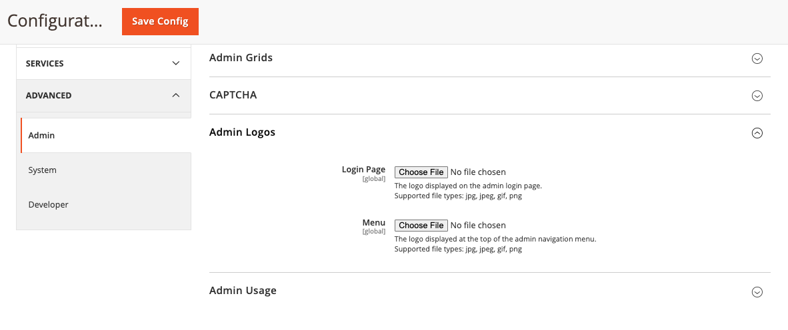
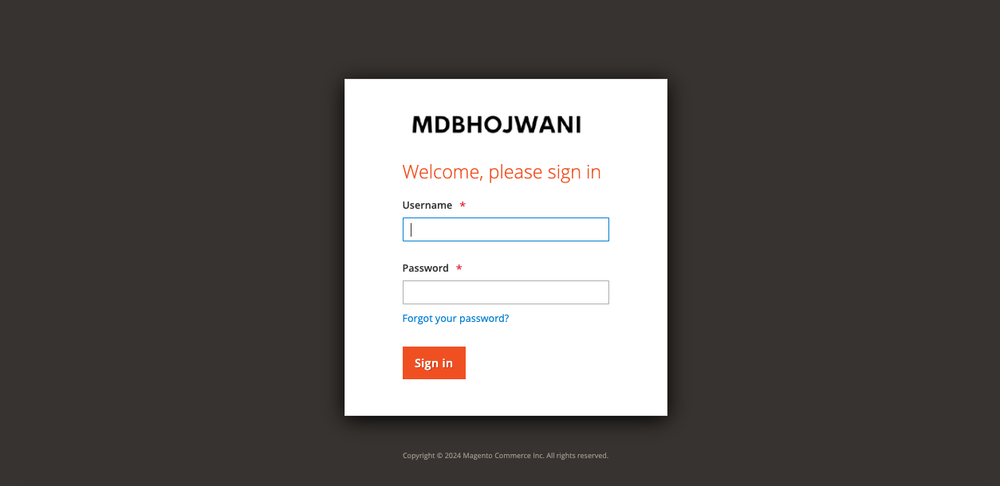
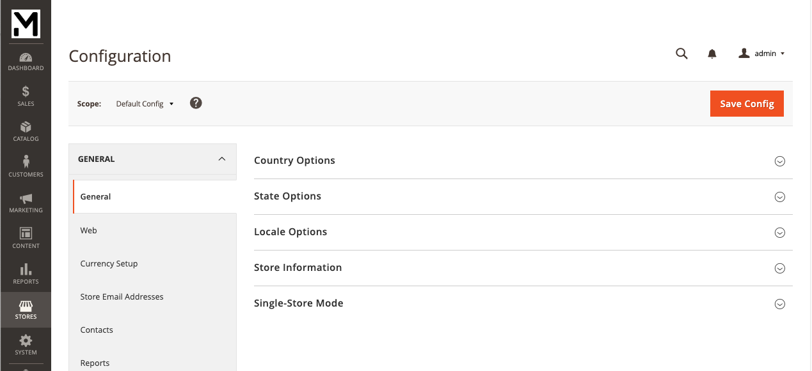

# Magento 2 Custom Admin Logo

## Table of contents

- [Summary](#summary)
- [Installation](#installation)
- [Configurations](#configurations)
- [License](#license)

## Summary

The Magento 2 "Custom Admin Logo" extension will allow admin user to set custom admin Login page and Side Menu Logo from admin.

### Key features:
1. Upload a custom logo for the admin login screen.
2. Upload a custom logo for the admin menu.
3. Easily revert to default logos.


## Installation

You can install the Extension using one of two methods:
 1. Via Composer 
 2. By downloading it directly from the available source.
 
### 1. Install via composer

To install the Extension via Composer, follow these steps in your Magento 2 root folder:

Run the following command:
```shell
composer require mdbhojwani/magento2-custom-admin-logo
```
After a successful installation, execute the following commands:

```shell
php bin/magento setup:upgrade
php bin/magento setup:static-content:deploy -f
php bin/magento c:c
```

With these steps completed, you'll be ready to utilize the Extension.

### 2. Download Directly

To install the Mdbhojwani Save For Later Extension you can download the Extension from below link:

https://github.com/mdbhojwani/magento2-custom-admin-logo

After successfully downloading the module, follow these steps to install it:

1. Unzip the downloaded folder.

2. Place the unzipped extension folder into the following path:

```shell
project-root-directory/app/code/Mdbhojwani/CustomAdminLogo
```

Indeed, after placing the extension folder in the specified directory, follow these Magento commands to complete the installation:
```shell
php bin/magento setup:upgrade
php bin/magento setup:static-content:deploy -f
php bin/magento c:c
```

By following these 2 Ways you can easily obtain and install the module. For detailed instructions on its usage, refer to the user guide within this document.


## Configurations

Login to the **Magento Admin**, navigate to ` Store -> Configuration -> Advanced -> Admin -> Admin Logos `.

<div>
    
</div>

### Admin Login Screen
<div>
    
</div>

### Admin Menu Screen
<div>
    
</div>


## License

[Open Software License ("OSL") v. 3.0](https://opensource.org/license/osl-3-0-php)

